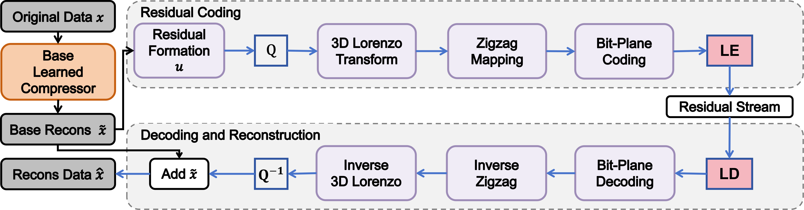
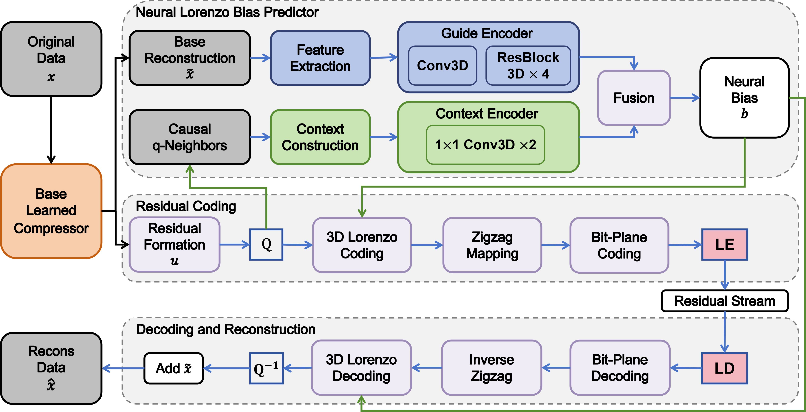

# Residual Modeling

This repository contains code for the paper:

**Residual Modeling for High-Fidelity Learned Compression of Scientific Data**  

## Overview
This project studies residual correction methods for high-fidelity learned compression of scientific data. The main idea is that the residual left by a learned compressor is not random noise. It still contains local spatial and temporal structure, and therefore should be modeled by a residual-specific representation.

The repository does **not** train the base lossy compressor. Instead, it assumes that a lossy compressor has already produced a reconstruction. Given the original data, the lossy reconstruction, and the bit cost of the base compressed representation, the methods in this repository compress the remaining residual so that the final reconstruction satisfies a target block-level NRMSE.

This repository includes three residual correction methods:

- **GAE**: PCA/SVD-based residual correction baseline.
- **LBRC**: Lorenzo-Based Residual Coding, a deterministic training-free residual coder.
- **NGLR**: Neural-Guided Lorenzo Residual Coding, a causal neural-guided residual coder.

## Methods

### GAE

GAE uses a PCA/SVD-style residual correction strategy. After the learned base compressor produces a reconstruction, GAE stores enough residual correction coefficients to satisfy the target reconstruction error. In this repository, GAE is used as the CAESAR-style PCA-based residual correction baseline.

### LBRC

LBRC is a deterministic residual coding method. It quantizes the learned residual according to the target block-level NRMSE, then applies 3D Lorenzo differencing, zigzag mapping, bit-plane coding, and entropy coding. LBRC does not require training and does not introduce additional learned parameters.
<p align="center">
  
</p>
### NGLR

NGLR extends LBRC with a causal neural bias predictor. The neural predictor uses base reconstruction features and causal quantized residual neighbors to improve the Lorenzo prediction. The NGLR model size is counted because the neural predictor is serialized as part of the compressed representation.
<p align="center">
  
</p>

## Environment

The code was tested on the University of Florida HiPerGator system with the following environment:

```text
Python 3.10.12
NumPy 1.24.1
Zstandard 0.25.0
PyTorch 2.9.1+cu128
```

The main experiments were run on NVIDIA B200 GPUs. LBRC can run on CPU. NGLR supports both CPU and GPU modes, but GPU is recommended.

## Input Format

The input should be an `.npz` file containing:

```text
original_data  # original scientific data
recons_data    # lossy reconstruction from a base compressor
latent_bit     # bit cost of the base compressed representation
```

The expected data shape is either:

```text
(B, T, H, W)
```

or

```text
(B, C, T, H, W)
```

The general workflow is:

1. Prepare an `.npz` file with `original_data`, `recons_data`, and `latent_bit`.
2. Choose one residual correction method: `GAE`, `LBRC`, or `NGLR`.
3. Edit the corresponding `.sh` file to set the input path, output path, target NRMSE, block size, device, and other options.
4. Run the `.sh` file.

In the paper, the methods are evaluated on:

- **E3SM** climate simulation data
- **JHTDB** turbulence data
- **ERA5** atmospheric reanalysis data
  
## Citation

If you use this code, please cite:
